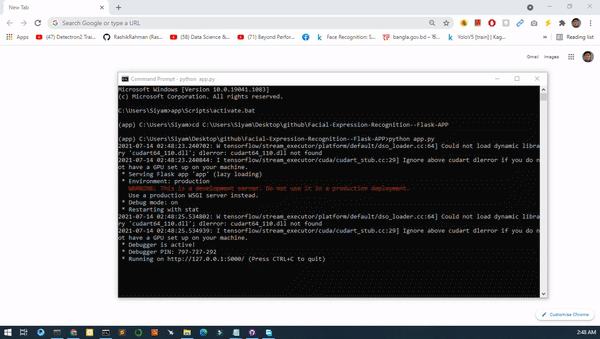

# Facial expression recognition.
Cutstom CNN model incorporated with data augmentation was used to train the model. Finally the model is converted to webapp using flask framework (Backend), html, css and bootstrap (Front end).

  

The dataset is collected from here: https://www.kaggle.com/code/alpertemel/fer2013-with-keras
